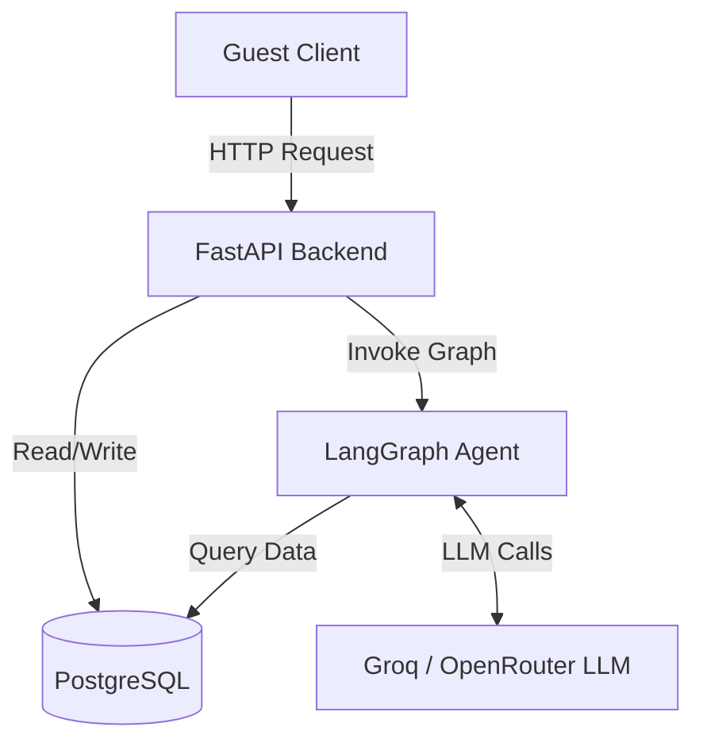

# StayEase - AI Booking Agent

## 1.1 System Overview

StayEase is a conversational AI agent for a short-term accommodation rental platform operating in Bangladesh. Guests interact with the agent through a chat interface to search for available properties, view detailed listing information, and create bookings. The system is built around four core components:

- **FastAPI Backend** — Serves as the HTTP layer, exposing RESTful chat endpoints for the client application.
- **LangGraph Agent** — Manages the conversational state machine, orchestrating intent classification, tool execution, and response generation.
- **PostgreSQL Database** — Persists property listings, booking records, and conversation history.
- **Groq / OpenRouter LLM** — Provides natural language understanding and generation capabilities to the agent.



## 1.2 Conversation Flow

The following walkthrough traces a complete interaction from start to finish.

**Guest input:** *"I need a room in Cox's Bazar for 2 nights for 2 guests"*

1. The guest sends the message via `POST /api/chat/{conversation_id}/message`.
2. FastAPI receives the request, loads the existing conversation state from PostgreSQL, and passes it to the LangGraph agent.
3. The `classify_intent` node invokes the LLM with the conversation history. The LLM determines that this is a property search request and generates a tool call for `search_available_properties`.
4. The `tools` node executes `search_available_properties(location="Cox's Bazar", nights=2, guests=2)`, which queries the database and returns a list of matching properties with nightly rates.
5. The `generate_response` node re-invokes the LLM with the tool output. The LLM formats the results into a readable message listing property names and prices in BDT.
6. The agent returns the final response to FastAPI.
7. FastAPI persists the updated conversation state to PostgreSQL and sends the response back to the guest.

## 1.3 LangGraph State Design

```python
class AgentState(TypedDict):
    messages: Annotated[list[AnyMessage], add_messages]
    escalate: bool
```

| Field | Type | Purpose |
|-------|------|---------|
| `messages` | `Annotated[list[AnyMessage], add_messages]` | Stores the full conversation history including user inputs, assistant replies, tool calls, and tool results. Uses the `add_messages` reducer for automatic appending. |
| `escalate` | `bool` | Set to `True` when the agent determines the request is outside its scope (not search, details, or booking), signaling that a human agent should take over. |

## 1.4 Node Design

### Node 1: `classify_intent`
- **What it does:** Invokes the LLM to analyze the latest user message and either emit a tool call or produce a direct response.
- **State updates:** Appends the resulting `AIMessage` to `messages`. Sets `escalate = True` if the request is out of scope.
- **Next node:** `tools` if a tool call is present, `escalate` if out of scope, or `END` if the LLM produced a final answer directly.

### Node 2: `tools`
- **What it does:** Executes the tool specified by the LLM (one of `search_available_properties`, `get_listing_details`, or `create_booking`).
- **State updates:** Appends the `ToolMessage` containing the execution result to `messages`.
- **Next node:** `generate_response`

### Node 3: `generate_response`
- **What it does:** Re-invokes the LLM with the updated conversation history so it can interpret the tool output and compose a user-facing reply.
- **State updates:** Appends the final `AIMessage` to `messages`.
- **Next node:** `tools` if the LLM requests another tool call (multi-step), or `END` if the response is complete.

### Node 4: `escalate`
- **What it does:** Generates a standard message informing the guest that their request will be handled by a human agent.
- **State updates:** Appends the escalation `AIMessage` to `messages`. Sets `escalate = True`.
- **Next node:** `END`

## 1.5 Tool Definitions

### `search_available_properties`
- **Input:** `location` (str), `nights` (int), `guests` (int)
- **Output:** JSON array of objects, each containing `id`, `name`, `price_per_night`, and `currency`.
- **Used when:** The guest wants to find available accommodations based on location, stay duration, and party size.

### `get_listing_details`
- **Input:** `property_id` (int)
- **Output:** JSON object containing `id`, `description`, `amenities`, and `house_rules`.
- **Used when:** The guest requests detailed information about a specific property.

### `create_booking`
- **Input:** `property_id` (int), `check_in_date` (str, YYYY-MM-DD format), `nights` (int), `guests` (int)
- **Output:** JSON object containing `booking_id`, `status`, `total_price`, and `currency`.
- **Used when:** The guest explicitly confirms they want to book a particular property.

## 1.6 Database Schema

### Table: `listings`

| Column | Data Type |
|--------|-----------|
| `id` | `SERIAL PRIMARY KEY` |
| `name` | `VARCHAR(255) NOT NULL` |
| `location` | `VARCHAR(255) NOT NULL` |
| `description` | `TEXT` |
| `price_per_night` | `DECIMAL(10,2) NOT NULL` |
| `max_guests` | `INT NOT NULL` |

### Table: `bookings`

| Column | Data Type |
|--------|-----------|
| `id` | `SERIAL PRIMARY KEY` |
| `listing_id` | `INT REFERENCES listings(id)` |
| `guest_name` | `VARCHAR(255) NOT NULL` |
| `check_in` | `DATE NOT NULL` |
| `check_out` | `DATE NOT NULL` |
| `guests_count` | `INT NOT NULL` |
| `total_price` | `DECIMAL(10,2) NOT NULL` |
| `status` | `VARCHAR(50) DEFAULT 'confirmed'` |

### Table: `conversations`

| Column | Data Type |
|--------|-----------|
| `id` | `UUID PRIMARY KEY` |
| `created_at` | `TIMESTAMP DEFAULT NOW()` |
| `updated_at` | `TIMESTAMP DEFAULT NOW()` |
| `state` | `JSONB NOT NULL` |

## 1.7 API Endpoints

The full API contract with request/response schemas, realistic examples, and error responses is documented in [`api.md`](api.md).

| Method | Endpoint | Description |
|--------|----------|-------------|
| `POST` | `/api/chat/{conversation_id}/message` | Send a guest message and receive the agent's response |
| `GET` | `/api/chat/{conversation_id}/history` | Retrieve the full conversation history for a session |
